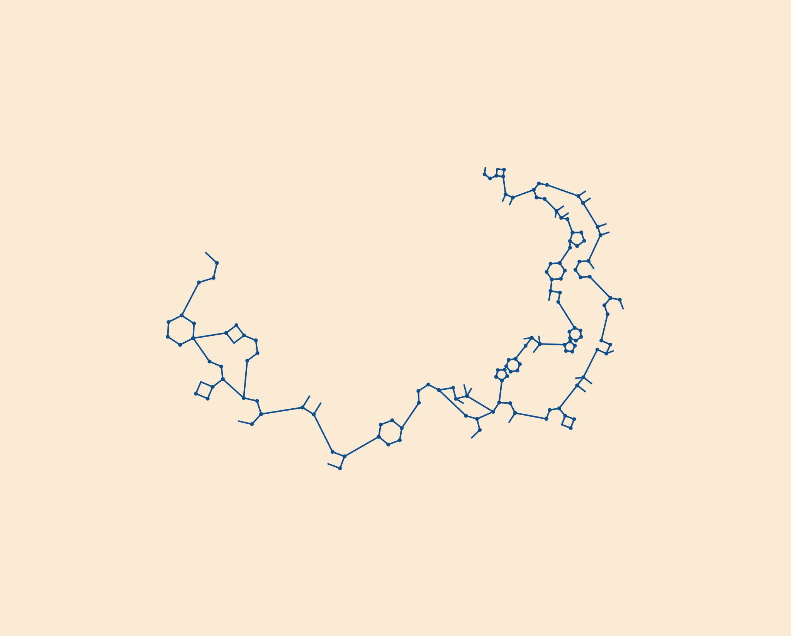

# Nomai Reversible

[Simplified Chinese](README.zh-CN.md)

Nomai Reversible is a fan-made, open-source text tool that turns Unicode text into Nomai-inspired spiral SVG writing and decodes its own generated SVGs back to the exact original text.

It is inspired by the visual language of *Outer Wilds* and by Evan Fields' excellent [NomaiText.jl](https://github.com/evanfields/NomaiText.jl). It is not an official Outer Wilds, Mobius Digital, or NomaiText.jl project.



## Why This Exists

Most fictional writing generators are either visual-only or language-only. Nomai Reversible is built around a different goal: make something that feels close to Nomai spiral writing while remaining mechanically reversible.

That means the SVG is not just decoration. Every generated SVG carries a compact `NOMAI1-*` token stream and metadata envelope, so the decoder can recover the original Unicode text exactly.

## Features

- **Reversible output**: decode generated SVGs or `NOMAI1-*` tokens back to the original text.
- **Unicode input**: encode Chinese, English, Japanese, emoji, and mixed-language text.
- **NomaiText.jl-style rendering**: glyph grids, polygon glyphs, annotations, outward scale growth, and a Luxor-like logarithmic spiral.
- **Collision-aware layout**: global spiral period growth and safe connector endpoint selection help avoid overlapping strokes.
- **Web UI and CLI**: use the browser app for quick experiments or the command line for scripted generation.
- **Free to fork**: MIT licensed, with a small TypeScript codebase designed for experimentation.

## Quick Start

```powershell
npm install
npm test
npm run build
npm run dev
```

Then open:

```text
http://127.0.0.1:5173/
```

## CLI

Generate an SVG:

```powershell
npm run cli -- encode "Hello Nomai!" --out examples\hello.svg
```

Generate JSON containing both the SVG and token stream:

```powershell
npm run cli -- encode "Hello Nomai!" --json
```

Decode from SVG:

```powershell
npm run cli -- decode examples\hello.svg
```

Decode from a token:

```powershell
npm run cli -- decode NOMAI1-...
```

## Web Workflow

1. Enter the text you want to encode.
2. Adjust seed or handwriting if desired.
3. Download the SVG, copy the SVG, or copy the token.
4. Paste the SVG/token into the decoder, or upload the generated `.svg` file.
5. Decode it back to the original text.

## Text Fields

`Text to encode and decode` is the canonical source. It controls both the visible Nomai geometry and the decoded result.

`English reading metadata` is optional. Use it for pronunciation notes, an English translation, or any reading aid you want to keep with the SVG. It is stored in metadata but does not change the Nomai drawing.

## How It Works

1. The source text is stored in a stable JSON envelope.
2. The envelope is encoded into a `NOMAI1-*` token with a CRC32 checksum.
3. The source text is converted into a large integer oracle.
4. The oracle drives glyph selection, glyph-grid placement, and connector choices.
5. The grid is typeset onto a Luxor-like logarithmic spiral and rendered as SVG.
6. The decoder reads SVG metadata or a token stream and restores the original envelope.

## Renderer Notes

The active renderer is a TypeScript port of the NomaiText.jl-style `draw_spiral` pipeline. It uses:

- a Unicode-safe visual oracle base of `200000`;
- a three-row glyph grid;
- known polygon glyphs and annotations;
- `PathGridLayout`-style scaling, spacing, and orientation;
- a logarithmic spiral based on Luxor's `spiral(164, .29, log=true)` behavior;
- global period growth when extra spacing is needed for collision-free output.

Julia is not required at runtime.

## Limitations

- Reversibility applies to SVG/token output generated by this project.
- Arbitrary screenshots, PNGs, or hand-drawn images are not OCR-decoded.
- This is a fan writing system, not a canonical in-game Nomai language.
- SVG is the main output format. Normal font and keyboard systems cannot directly typeset full spiral writing.

## Roadmap

- Improve visual density for long passages.
- Add curated example galleries and visual regression tests.
- Explore linear token fonts and Keyman keyboard assets.
- Optionally integrate open-source translation or phonemization tools for reading metadata.

## Credits

- Visual and algorithmic inspiration: [evanfields/NomaiText.jl](https://github.com/evanfields/NomaiText.jl)
- Community reference: [YanWittmann/ow-written-nomai-lang](https://github.com/YanWittmann/ow-written-nomai-lang)
- Original fictional writing aesthetic: *Outer Wilds* by Mobius Digital

## License

MIT. See [LICENSE](LICENSE).
